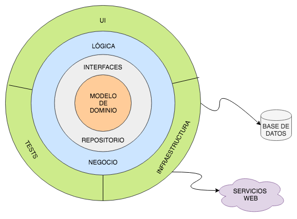
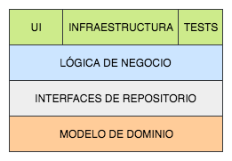
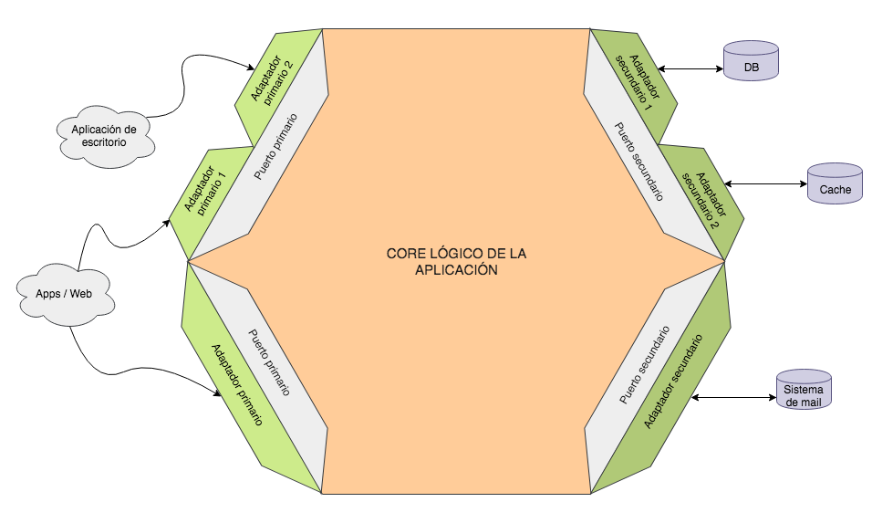
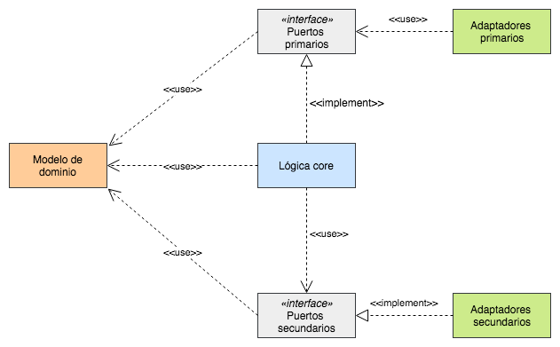
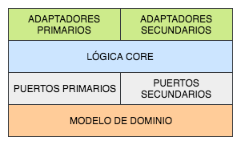

# Architecture

Notas de estudio sobre arquitectura de software cosas que me han ido gustando y quiero plasmar acá.

## Arq para aplicaciones React

[REF](https://www.youtube.com/watch?v=bFcUj-7VEho)

Citando un poco a Khalil Stemmler, la lógica de negocio no pertenece al frontend. Nuestros frontend deberían ser tontos a nivel de lógica y mantenerlos simples a nivel de arquitectura es uno de los mayores desafíos. A través de estos patrones de diseño transformamos react en una especie de angular, con código verboso y difícil de leer. Si bien hay casos de uso para la aplicación de esta arquitectura, no creo que sea recomendable para el 90% de los casos, ya que nuestro foco debería ser hacer software más pequeño, eficiente y por sobre todo, simple. El fondo, lo comparto totalmente (Depender de contratos y no de implementaciones, desacoplamiento, sustitución, testeabilidad), pero creo que podemos encontrar arquitecturas más simples para aplicarlo.

## ¿Qué es la clean Arq, Cómo aplicarlo a Frontend?
[REF VIDEO](https://www.youtube.com/watch?v=vRGVnqylO68)
las arquitecturas tienen un propósito similar con un enfoque/orientación diferente.
"Separación responsabilidades/componentes/usos"

Domain - Core
1- Todo lo que toca el sol depende de dominio
2 ¿De que depende el dominio?
- Nada, el dominio no se toca
- Entidades, Reglas de negocios

Application/Presentation
- Casos de uso
- "Todo lo que modifica las entidades"
  
Adapters: Comunica con servicios externos y adapta todo con nuestra app.
Convertir información antes de ir al dominio - DTO

Dependency Role:
Domain <- Application <- Adapters

--- 
"Acortar bordes (Quitar cosas para llegar)"
Evitar Dependencias circulares
Bajamente acoplado |
Altamente cohesivo | Reusable, sin efectos secundarios

Ventajas: Dominio separado
Casos de uso independientes
Servicios externos intercambiables

Desventajas: 
Lleva tiempo
Overlay verbose (demasiado detallado)
Onboarding más difícil
Incrementa el tamaño del código

¿Cómo cortar caminos de forma correcta?
-> Extrae el dominio. "Puedes saltar otras capas"
-> No acortar el dependency role

## Clean Architecture
REF: Dev experto -  Antonio Leiva

Conceptos:
1- ¿Por qué todo en capas?
2- ¿Tienes reglas flexibles e interpetables?

## Clean para aplicaciones en React
REF: Osma CEA

- A medida que crece podemos crear más capas
- Capas nos ayudan a evitar dependencias circulares
  

## Desarrollo Web -  Arq de software vs Arq Hexagonal
REF: Javier velez Reyes - "Ni nueva, Ni arquitectura, Ni exagonal"

Cryptal clear - Rup XP
La arq son la vuelta de tuerca de MVP
"Controladores y modelos" deben tener el mismo comportamiento, si se usan con vista

**Heragonal** Tambien se llama puertas y adaptadores
- Controladores y modelos no acoplados a ningun framework
- Vistas -> Atacan comunicación -> Dependiendo de la interfaz que publique los controladores

Cualquier mantenimiento adaptativo debería ser open-close, podemos añadir cosas sin que afecte lo actual
**Tip** Una forma de no usar Inyección, es con Prototype y Abstract Factory

Puerto = Plugin = Interfaz
Actores = Son los que atacan(interacción)

Una app debe comportase igual sin importar quien la ataque (ej: usuarios, test, otro sistema)

## ¿Qué cambio mi forma de ver la arq?
REF = CODELY

- Retos de escalabilidad
- Composición vs herencia
- Contenedor de dependecias
- Modelo adaptadores
- Hexagonal
- Value Objects (DDD)
- Testing
- Integración continua
- DTO vs GET
- Programación reactiva
- Agile

## Introducción a Arq de software 
REF = Codely

-> Reglas que definimos para mejorar nuestro entendimiento de una APP
-> Evitar el acoplamiento

Común entre todas las arq:
-> Distintas capas
-> Regla de dependencia (fuera hacia adentro)

Estructura de carpetas:
-> mooc "Bundle context"

## Arquitectura Android:
REF: Dev Experto

- Patrones de arquitectura MVC, MVVM
Definen como se organiza la capa de presentación

Estructura

View <-  Mediador  -> Model
Mediador: Diferente MVC, MVP, MVVM

MVC = Domain - xml - Activity
MVP = Domain - Activity - Presenter
MVVM = Domain - Activity - Observables

**Una capa de presentación, lógica y otra acceso a datos**

## Arquitectura del software
REF= https://www.youtube.com/watch?v=MbX0hGRiJm8
"Parabola del ciego y el elefante"
- Por qué? Resolver Sistemas complejos
- Para qué? "Calidad del software".... desarrollo efectivo(no frágil), eficaz y eficiente. Escalable y adaptabilidad. Depende de Mantenibilidad

- Cuándo? 1960-1990
- Dónde? The humble programmer
- Quién? Edsger Dijkstra

El código tiende hacer aburrido.

Top-Down: Hacemos arquitectura y luego vemos como encaja
Down-Top: La arquitectura surge y se va construyendo

Aplicar el principio OpenClose por medio de Liskov

El largo camino de enterarte de lo que estan diciendo

DDD una manera de pensar
- Prioridades

Cohesion -> Single responsabilty Principle (es la causa, no la consecuencia)

Lo complejo en arq es intentar hacer algo muy grande sin entender el camino

---
## TDD
TDD => Prubas -> Implementación y Diseño
No se añade código sin pruebas
NO Estrategia de software
Combatir miedos que tengo con TDD

Estrategias:
Viejos: Diseño -> implemetación -> pruebas
Alternativo:  Diseño -> pruebas -> implemetación

Tener pruebas buenas es mejor tenerlas que no
-> No Es una estrategia de testing

TSDD
ATDD
BTDD

Se puede relajar o poner más duro con las pruebas
TDD te ayuda a descubrir el diseño

Se saca provecho en el Dominio (Si se tiene o no tienes conocimiento)

SISTEMA
Un sistema es un conjunto de componentes interactuando o interdependientes formndo un todo integrado. Cada sistema esta delimitado por sus limites espacio/temporales e influenciado por su entorno descrito por su estructura y proposito y expresado en su funcionalidad

SISTEMA COMPLEJO
El que excede la complejidad humana

Objetivo Software
Eficacia y Eficiencia

## Lenguajes de programación y paradigmas
- Fuertemente tipados, Debilmente tipados y Inferencia de tipos (Typescript)
- Compilador, interpretado y Maquinas virtuales un intermedio

Paradigmas de software: Forma de ver el software
Imperativo => Decirle que hacer (Importa el como)
Funcional => NO Asignaciones, NO Variables, NO bucles. = Recursividad y funciones
No por tener funciones de orden superior un lenguage ya es Declarativo

Maquina de Turing: Paradigma imperativo
Cálculo Lambda: Paradigma funcional (Math)
Cláusulas de Horn: Paradigma lógico

Declarativo: unión entre funcional y lógico (Importa el que)

Tipos de paradigmas de lenguajes
Paradigma, Orientado a Procesos, Orientado a Datos, Orientado a Objetos
* Concurrente, Eventos, Aspectos, Exotéricos

No porque uses clases y herencia estás haciendo programación orientada a Objetos
-> Muchas cosas adicional

"Faltan desarrolladores de calidad"

No se trata de que mis programas funcionen; Funcionen y se puedan modificar
- Legibilidad: Software Autoexplicativo, Consistente, Mínimo

#### Diseño Modular
Como evitar Smell Codes
- Cohesión
- Acomplamiento
- Tamaño

- Si desacoplamos podemos justificar de donde salen los controladores
- Herencia para dar Extensión no necesariamente reusabilidad

### ¿Qué es ARQUITECTURA DE SOFTWARE?
REF = https://www.youtube.com/watch?v=7ukajubprdE
- La arquitectura de software de un sistema es el conjunto de **estructuras** necesarias para **razonar** acerca del sistema
- La arquitectura de software es el conjunto de **decisiones de diseño** importantes para organizar el software y promover los **atributos de calidad** deseados
- Acerca de las cosas importantes. Sean las que sean

## Introducción a la arquitectura de software
REF= https://www.youtube.com/watch?v=n6XvfUG4QBQ

Que deberiamos tener:
Requerimientos |-> Diseño            |-> 
               |-> Especificación(S) |-> Programador

Arquitectura de software: Es parecido a  Diseño de software
- Dividir el sistema en elementos de software
-(S) Definir la funcionalidad de cada elemento
- Establecer las relaciones entre los elementos

## Cómo estructurar tu project de ReactJs?
REF= https://www.youtube.com/watch?v=5LqhlCd2_nE

## Capas, cebollas y colmenas: arquitecturas en el backend
REF= https://www.adictosaltrabajo.com/2019/07/02/capas-cebollas-y-colmenas-arquitecturas-en-el-backend/

Lo primero que tenemos que dejar claro es qué entendemos por arquitectura. La arquitectura de un sistema software es la definición de qué componentes constituyen ese sistema, sus responsabilidades y las relaciones de uso y dependencia entre ellos. Es, por tanto, completamente independiente de la tecnología que se utilice y no debería representar en ningún momento el framework, la base de datos o la forma de interactuar con el usuario.

Al hablar de **arquitectura multilayer** podemos diferenciar además entre sistemas estrictos (strict layered systems) y relajados (relaxed layered systems)

Un sistema estricto es aquel en el que una capa solo depende directamente de la capa inmediatamente inferior, mientras que en un sistema relajado puede hacerlo de todas las que hay por debajo aunque no sean contiguas. Más adelante veremos para qué es esto útil.

Hemos visto que las dependencias van de arriba hacia abajo.
Pero en algunos casos necesitamos que haya una comunicación de abajo hacia arriba, entonces el patrón observer nos puede ayudar con eso.

### ONION

### Hexagonal (Ports and Adapters)
El objetivo de la arquitectura hexagonal es poner, una vez más, en el centro del sistema toda la lógica propia del dominio y definir unas fronteras muy claras y unos mecanismos de **transformación con el exterior**

Nuestra arquitectura se compondrá de tres cosas:
la lógica core de la aplicación, los puertos y los adaptadores

Cualquier comunicación con el exterior se hará única y exclusivamente a través de los puertos y adaptadores, que se encargarán de la conversión de datos para que dentro de las fronteras todo esté en nuestro idioma.

Los puertos son las interfaces que definen la interacción con el exterior y exponen únicamente datos de nuestro dominio, dejando que toda la lógica de transformación esté de puertas afuera y no se contamine el interior.

Una cosa importante a tener en cuenta (tal y como se ve en la imagen de arriba) es que un único puerto puede tener más de un adaptador asociado

Además, en la imagen habréis visto que tanto puertos como adaptadores están divididos en primarios y secundarios (también llamados driving y driven respectivamente). Los primarios definen el comportamiento que expone nuestro sistema al exterior, la comunicación con el usuario (sea este una persona, otra aplicación…). Por su parte los secundarios definen la interacción que necesita nuestro sistema con terceros (base de datos, cachés, otros sistemas) para ejecutar correctamente sus funcionalidades de principio a fin. A grandes rasgos podríamos decir que los primarios son de entrada y los secundarios son de salida en el sentido de la dirección en la que viajan las peticiones.

Los puertos primarios son interfaces de funcionalidad del sistema, por lo que estarán implementadas por la capa de servicios dentro del hexágono. Los adaptadores primarios usan, y no implementan, dichos puertos para comunicarse como necesiten con el interior.
Los puertos secundarios, por su parte, sirven de interfaz de salida para que el interior se comunique con sistemas externos. En este sentido el core utilizará los puertos secundarios, que esta vez serán implementados por los adaptadores secundarios.

### Clean architecture

El objetivo es el mismo que hemos estado persiguiendo hasta ahora, y la implementación es a grandes rasgos una hexagonal aunque cambiando algunos nombres y definiendo mínimamente la estructura interna

https://blog.cleancoder.com/uncle-bob/2012/08/13/the-clean-architecture.html

- Entidades = Domain
- Casos de uso = lógica propia de la aplicación
- Use Case Input Port (si son primarios)
- Use Case Output Port (si son secundarios),
- implementación de los de entrada está en lo que se denomina Use Case Interactor.
- adaptadores: controladores, presentadores, acceso a terceros