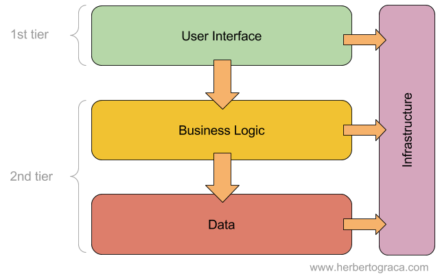
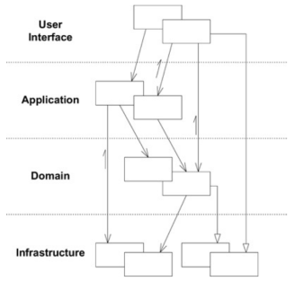
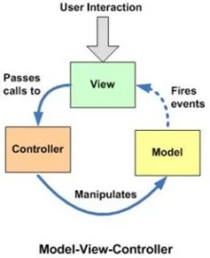
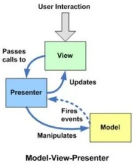
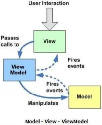
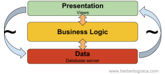
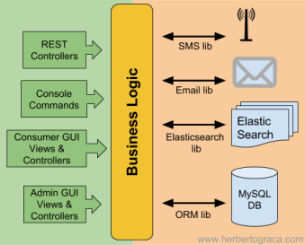
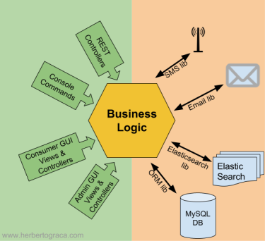

# The Software Architecture Chronicles

## Layered Architecture

**Ventajas**
- Solo necesitamos entender las capas en las que estamos trabajando
- Cada capa es replicable por una implementación equivalente sin impactar otras capas
- Capas son optimas candidatas para estandarización
- Una capa puede usar diferentes high-level layers
  
**Desventajas**
- Las capas no pueden encapsular todo
- Cada capa añade un grado de complejidad mayor
  
### Capas 60s -  70
Todo junto
### Capas 80 - 90
- User Interface (Presentation): The user interface, be it a web page, a CLI or a native desktop application;
- Business logic (Domain): The logic that is the reason why the application exists
- Data source: The data persistence mechanism (DB), or communication with other applications.

### Capas después de mediados de los 90s

- A native browser application, rendering and running the user interface, sending requests to the server application;
- An application server, containing the presentation layer, the application layer, the domain layer, and the persistence layer;
- A database server, which would be used by the application server for the persistence of data.

### Layering after the early 2000s

- **UserInterface:** Responsable de dibujar las vistas para los usuarios interactuen con la app.

- **Application Layer:** Es el que orqueta los objetos de dominio para hacer tareas que requieren los usuarios. No contiene lógica de negocio.

- **Domain layer:** Este contiene toda la lógica de negocio, las entidades, evento y otras cosas relacionados al dominio del problema.

- **Infrastructure:** Las capacidades técnicas que soportan las capas anteriores, persistencia, mensajeria, etc.

En contra parte **LASAGNA ARCHITECTURE:**
- Decidimos utilizar un enfoque de capas estricto , donde una capa solo conoce la capa inmediatamente debajo de ella. En tal caso, terminaremos creando métodos proxy, e incluso clases proxy , solo para pasar por las capas intermedias en lugar de usar directamente la capa que necesitamos;
- Llevamos el proyecto a  una abstracción excesiva en un afán por crear el sistema perfecto;
- Las pequeñas actualizaciones repercuten en todas las áreas de una aplicación , por ejemplo, ordenar una sola capa puede ser una gran tarea con grandes riesgos y una pequeña recompensa
- Terminamos con demasiadas capas , lo que aumenta la complejidad del sistema general;
- Terminamos con demasiados niveles , lo que aumenta la complejidad y daña el rendimiento del sistema en general;
- Organizamos explícitamente nuestro monolito según sus capas (es decir, interfaz de usuario, dominio, base de datos), en lugar de organizarlo por sus subdominios/componentes (es decir, producto, pago, pago), destruyendo la modularidad y la encapsulación de los conceptos de dominio.

**Conclusión**
Sin embargo, como la mayoría de las cosas en la vida, ¡demasiado es contraproducente! Entonces, la regla general es: use solo las capas que necesitamos, los niveles que necesitamos, ¡y nada más! No debemos dejarnos llevar persiguiendo un santo grial arquitectónico, que no existe. Lo que sí existe es una necesidad, y el mejor ajuste posible para esa necesidad.

## MVC and its alternatives

### 1979 – Model-View-Controller

MVS fue uno de los primeros marcos en hablar sobre "Separación de responsabilidades"

MVC separaba nuestro código en tres unidades conceptuales:
- **Modelo:** Representa the business logic
  
- **View:** Representa un widget in the UI: a button, a box, etc
  
- **Controller:** Provee la coordinación entre la vista y el modelo.
  * Decide que se muestra en la vista y que información
  * Traduce una acción del usuario en business logic

**Conceptos adicionales**
- La vista usa los Model data objects directly
- Cuando el modelo cambia, este dispara un evento inmediatamente para actualizar la vista
- Cada view se relaciona con un controlador
- Cada screen puede contener varios pares de view & controller
- Puede haber multiples view por cada controlador

### 1996 – Model-View-Presenter
MVC proponia una mejora considerable en como se programaba. Sin embargo, la complejidad sigue creciendo entonces necesitamos un mayor desacoplamiento.

Basado en MVC pero con los siguientes conceptos:
- La vista es pasiva e ignora el modelo
- El focus esta en pequeños(thin) controladores (PRESENTADORES) que no contienen business logicy simplemente invocan comandos y queries(CQRS), pasando raw(cruda) data a la vista.
- Un cambio en la data no dispara y actualiza la vista directamente. Siempre va primero al controller(presenter) que realiza una lógica adicional antes de actualizar la vista.
- Solo hay un presentador por cada vista.

### 2005 – Model-View-ViewModel

Cuando las aplicaciones incrementaron su complejidad, se presento MVVM, con el objetivo de hacer una segregación/separación aun más UI design del código y proveer un 'data binding'(enlace de datos) desde la vista hasta el data model

El controlador es reemplazado por ViewModel

**Conceptos:**
- Un ViewModel corresponde a una única vista y viceversa
- Mover la lógica de la vista al ViewModel para simplificar la vista
- Pueden existir uno o más mapeos entre la data usada in la vista y la data en el viewModel
- Binding/Enlace los datos del viewModel en la vista, de modo que cuando los datos se cambian en el viewModel se reflejan en la Vista

### Model-View-Presenter-ViewModel
Cuando creamos aplicaciones empresariales muy complejas para la nube.
El viewModel es lo que Martin Fowler llama Presentation Model.

- Model: Un set de clases que contienen toda la 'business logic' & casos de uso
- View: Un template que genera el HTML usando un template-engine
- ViewModel: Recibe la raw-data desde una query y conserva la data que se usa en el template. Tambien encapsula lógica compleja de presentation para simplificar el template. Encuentro que el viewmodel es útil porque no usamos entidades en el template y esto nos permite aislar completamente la vista del modelo.
  * Los cambios en el model(changes entities structure) pueden aparecer e impactar el modelo de vista pero no el template.
  * La lógica de presentación no se filtra al dominio porque podemos encapsularla en el viewmodel
  * Las dependencias del template se vuelven explicitas porque deben configurarse en viewModel.
- Presenter Recibe una HTTP reques y dispara un command o query, usa la información que retorna la query, un ViewModel a Template and a template engine to generate the HTML and send it back to the client.

## DDD

Algunos conceptos

- **Ubiquitous language**: 
  La idea principal de usar un lenguaje ubicuo es alinear la aplicación con el negocio. Esto se logra mediante la adopción de un lenguaje común, entre el negocio y la tecnología
- **Layers** UI, Application, Domain, Infrastructure
- **Bounded contexts**
  Dividir el problema en contextos acotados donde la carga cognitiva para un desarrollador sea menor.
  * Crear subsistemas que pueden contener subsistemas
  * La tarea de un subsistemas es empaquetar objetos para que se reduzca la complejidad
  * Objetos que tengan que ver con una funcionalidad deben pertenecer a un subsistema
  * Un objetivo es tener un acoplamiento fuerte entre subsistemas y debil entre subsistemas (También conocido como acoplamiento y alta cohesión)
  * Un subsistema debería estar acopado preferiblemente a un solo actor
  * Comience colocando el objeto de control en un subsistema y luego coloque los objetos de entidad fuertemente acopados y los objetos de interfaz en el mismo subsistema
  * Todos los objetos con un fuerte acoplamiento funcional mutuo se colocarán en el mismo subsistema
  * Otro criterio para la división puede ser
    ∞ Diferentes grupos de trabajo con diferentes competencias o recursos
  
- **Anti-Corruption Layer**
  Es básicamente un middleware entre dos subsistemas. Se utiliza para aislar los dos subsistemas, haciendolos depender directamente uno del otro. Si refactorizamos o reemplazmos uno de los dos subsistemas solo debemos actualizar la capa anti-corrupción.

  Esto es útil cuando tenemos un nuevo sistema que necesitamos integrar con un sistema heredado. Para no dejar que la estructura heredada dicto como diseñamos el nuevo sistema. Creamos una capa anticorrupción que adaptara la API del subsistema heredado a las necesidades del nuevo sistema.

  PREOCUPACIONES
  - Adaptar las APIs de los subsistemas a lo que necesitan los subsistemas del cliente.
  - Traducir datos y comandos entre subsistemas
  - Establecer comunicación en una o varias direcciones, según sea necesario

- **Shared Kernel**
  manterlo pequeño y tener cuidado para no romper otro código.
  
- **Generic Subdomain**
  Esto es un dominio que no es especifico de nuestra aplicación y podría usarse en cualquier aplicación similar.

## Ports & Adapters Architecture

El enfoque tradicional nos trae diferentes problemas, terminamos teniendo fuga de lógica comercial en la interfaz de usuario. 
Podemos tener fugas de tecnologías externas o bibliotecas en la lógica de negocios.

### Evolución de la arq en capas
Gracias a EBI o DDD, sabiamos que lo realmente son las capas internas. Estas capas son donde vive toda la lógica del negocio, ahí esta el diferencial esta es la verdadera aplicación.

Por otro lado Alistair CockBurn se dio cuenta de que las capas superior e inferior, por otro lado eran simplemente puntos de entrada/salida hacia/desde la aplicación.

Aunque en realidad son diferentes, tiene objetivos muy similares y hay simetría en el diseño. Además si queremos aislar las capas internas de nuestra aplicación, podemos hacerlo usando esos puntos de entrada/salida, de manera similar.

Una forma de representarlo

Aunque podamos identificar dos lados simétricos de la aplicación, cada lado puede tener diferentes puntos de entrada/salida. Ex: Una API y una UI son dos puntos de entrada/salida diferentes.

Pudo haber sido cualquier poligono pero se escogio. Un hexagono.

La arquitectura ports and adapters resuelve los problemas identificados anteriormente mediante el uso de una capa de abstracción, implementada como un punto y un adaptador.

### Puertos
Un puerto es un punto de entrada y salida independiente del consumidor hacia/desde la aplicación. En muchos lenguajes es una interface.
En nuestra aplicación, usaremos esta interfaz como un punto de entrada y/o salida sin conocimiento de la implementación concreta que realmente se inyectará donde la interfaz se define como una sugerencia de tipo.

### Adaptador
Es una clase que transforma(adapta) una interfaz en otra.

Los adaptadores que representan la interfaz de usuario se denominan **adaptadores primarios** o de **control** porque son los que inician alguna acción en la aplicación, mientras que los adaptadores del lado derecho, que representan las conexiones a las herramientas externas/backend se le denominan **adaptadores secundarios** o **conducidos** porque siempre reaccionan a una acción de un adaptador primario.

También hay diferencia como se usan los puertos/adaptadores

- En el lado izquierdo, el adaptador depende del puerto y se inyecta una implementación concreta del puerto que contiene el caso de uso. Por este lado tanto el puerto como su implementación concreta(caso de uso) pertenecen dentro de la aplicación.
- En el lado derecho , el adaptador es la implementación concreta del puerto y se inyecta en nuestra lógica comercial, aunque nuestra lógica comercial solo conoce la interfaz. Por este lado, el puerto pertenece al interior de la aplicación, pero su implementación concreta pertenece al exterior y envuelve alguna herramienta externa.

### ¿Cuales son los beneficios?
El uso de un diseño puerto/adaptador, con nuestra aplicación en el centro del sistema, nos permite mantener la aplicación aislada de los detalles de implementación como tecnologías efímeras, herramientas y mecanismos de entrega, lo que facilita y acelera la prueba y la creación de test.

### Conclusión
A mi modo de ver, la arquitectura de puertos y adaptadores tiene un solo objetivo: aislar la lógica empresarial de los mecanismos y herramientas de entrega que utiliza el sistema . Y lo hace mediante el uso de una construcción de lenguaje de programación común: interfaces

En el lado de la interfaz de usuario (los adaptadores de conducción), creamos adaptadores que usan nuestras interfaces de aplicación , es decir. controladores

En el lado de la infraestructura (los adaptadores controlados), creamos adaptadores que implementan nuestras interfaces de aplicación , es decir. repositorios

## ONION Architecture
Es una arquitectura basada en Hexagonal añadiendo que el dominio debe ir en el centro de de la aplicación.

Capas:
- Presentation
- Application
- Domain
- Persistence

Sin embargo, Onion Architecture también nos dice que, en las aplicaciones empresariales, tendremos más de esas dos capas, y agrega algunas capas en la lógica de negocios que podríamos reconocer del Domain Driven Design:

- Las capas exteriores dependen de las capas interiores;
- Las capas internas no conocen las capas externas.

## Clean Architecture