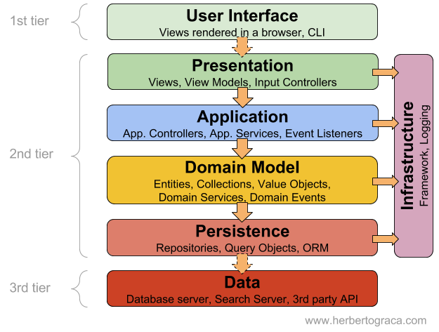
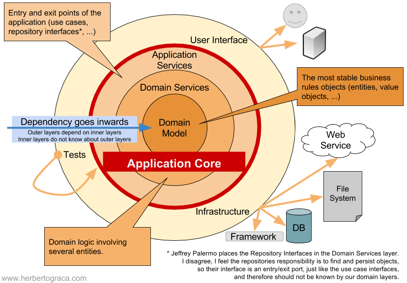
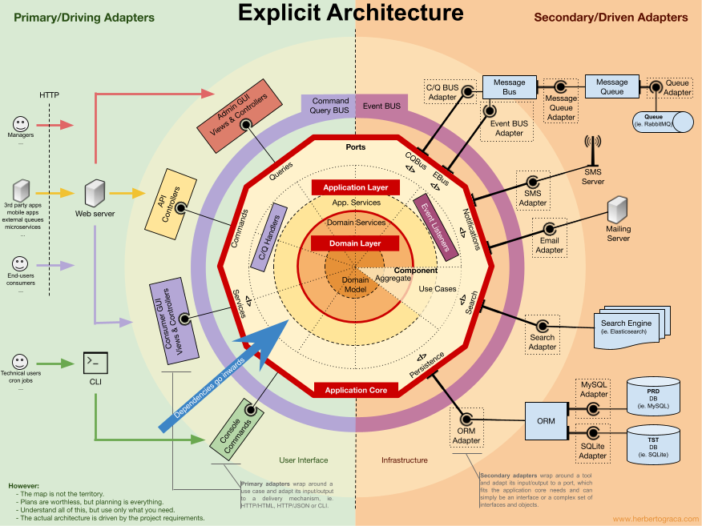

# The Software Architecture Chronicles
https://herbertograca.com/2017/07/03/the-software-architecture-chronicles/

PENDIENTE:
CRQS
SOA
EVENTOS

## Layered Architecture

**Ventajas**
- Solo necesitamos entender las capas en las que estamos trabajando
- Cada capa es replicable por una implementación equivalente sin impactar otras capas
- Capas son optimas candidatas para estandarización
- Una capa puede usar diferentes high-level layers
  
**Desventajas**
- Las capas no pueden encapsular todo
- Cada capa añade un grado de complejidad mayor
  
### Capas 60s -  70
Todo junto
### Capas 80 - 90
- User Interface (Presentation): The user interface, be it a web page, a CLI or a native desktop application;
- Business logic (Domain): The logic that is the reason why the application exists
- Data source: The data persistence mechanism (DB), or communication with other applications.

### Capas después de mediados de los 90s

- A native browser application, rendering and running the user interface, sending requests to the server application;
- An application server, containing the presentation layer, the application layer, the domain layer, and the persistence layer;
- A database server, which would be used by the application server for the persistence of data.

### Layering after the early 2000s

- **UserInterface:** Responsable de dibujar las vistas para los usuarios interactuen con la app.

- **Application Layer:** Es el que orqueta los objetos de dominio para hacer tareas que requieren los usuarios. No contiene lógica de negocio.

- **Domain layer:** Este contiene toda la lógica de negocio, las entidades, evento y otras cosas relacionados al dominio del problema.

- **Infrastructure:** Las capacidades técnicas que soportan las capas anteriores, persistencia, mensajeria, etc.

En contra parte **LASAGNA ARCHITECTURE:**
- Decidimos utilizar un enfoque de capas estricto , donde una capa solo conoce la capa inmediatamente debajo de ella. En tal caso, terminaremos creando métodos proxy, e incluso clases proxy , solo para pasar por las capas intermedias en lugar de usar directamente la capa que necesitamos;
- Llevamos el proyecto a  una abstracción excesiva en un afán por crear el sistema perfecto;
- Las pequeñas actualizaciones repercuten en todas las áreas de una aplicación , por ejemplo, ordenar una sola capa puede ser una gran tarea con grandes riesgos y una pequeña recompensa
- Terminamos con demasiadas capas , lo que aumenta la complejidad del sistema general;
- Terminamos con demasiados niveles , lo que aumenta la complejidad y daña el rendimiento del sistema en general;
- Organizamos explícitamente nuestro monolito según sus capas (es decir, interfaz de usuario, dominio, base de datos), en lugar de organizarlo por sus subdominios/componentes (es decir, producto, pago, pago), destruyendo la modularidad y la encapsulación de los conceptos de dominio.

**Conclusión**
Sin embargo, como la mayoría de las cosas en la vida, ¡demasiado es contraproducente! Entonces, la regla general es: use solo las capas que necesitamos, los niveles que necesitamos, ¡y nada más! No debemos dejarnos llevar persiguiendo un santo grial arquitectónico, que no existe. Lo que sí existe es una necesidad, y el mejor ajuste posible para esa necesidad.

## MVC and its alternatives

### 1979 – Model-View-Controller

MVS fue uno de los primeros marcos en hablar sobre "Separación de responsabilidades"

MVC separaba nuestro código en tres unidades conceptuales:
- **Modelo:** Representa the business logic
  
- **View:** Representa un widget in the UI: a button, a box, etc
  
- **Controller:** Provee la coordinación entre la vista y el modelo.
  * Decide que se muestra en la vista y que información
  * Traduce una acción del usuario en business logic

**Conceptos adicionales**
- La vista usa los Model data objects directly
- Cuando el modelo cambia, este dispara un evento inmediatamente para actualizar la vista
- Cada view se relaciona con un controlador
- Cada screen puede contener varios pares de view & controller
- Puede haber multiples view por cada controlador

### 1996 – Model-View-Presenter
MVC proponia una mejora considerable en como se programaba. Sin embargo, la complejidad sigue creciendo entonces necesitamos un mayor desacoplamiento.

Basado en MVC pero con los siguientes conceptos:
- La vista es pasiva e ignora el modelo
- El focus esta en pequeños(thin) controladores (PRESENTADORES) que no contienen business logicy simplemente invocan comandos y queries(CQRS), pasando raw(cruda) data a la vista.
- Un cambio en la data no dispara y actualiza la vista directamente. Siempre va primero al controller(presenter) que realiza una lógica adicional antes de actualizar la vista.
- Solo hay un presentador por cada vista.

### 2005 – Model-View-ViewModel

Cuando las aplicaciones incrementaron su complejidad, se presento MVVM, con el objetivo de hacer una segregación/separación aun más UI design del código y proveer un 'data binding'(enlace de datos) desde la vista hasta el data model

El controlador es reemplazado por ViewModel

**Conceptos:**
- Un ViewModel corresponde a una única vista y viceversa
- Mover la lógica de la vista al ViewModel para simplificar la vista
- Pueden existir uno o más mapeos entre la data usada in la vista y la data en el viewModel
- Binding/Enlace los datos del viewModel en la vista, de modo que cuando los datos se cambian en el viewModel se reflejan en la Vista

### Model-View-Presenter-ViewModel
Cuando creamos aplicaciones empresariales muy complejas para la nube.
El viewModel es lo que Martin Fowler llama Presentation Model.

- Model: Un set de clases que contienen toda la 'business logic' & casos de uso
- View: Un template que genera el HTML usando un template-engine
- ViewModel: Recibe la raw-data desde una query y conserva la data que se usa en el template. Tambien encapsula lógica compleja de presentation para simplificar el template. Encuentro que el viewmodel es útil porque no usamos entidades en el template y esto nos permite aislar completamente la vista del modelo.
  * Los cambios en el model(changes entities structure) pueden aparecer e impactar el modelo de vista pero no el template.
  * La lógica de presentación no se filtra al dominio porque podemos encapsularla en el viewmodel
  * Las dependencias del template se vuelven explicitas porque deben configurarse en viewModel.
- Presenter Recibe una HTTP reques y dispara un command o query, usa la información que retorna la query, un ViewModel a Template and a template engine to generate the HTML and send it back to the client.

## EBI
La arquitectura Entity-Boundary-Interactor fue dada a conocer por Robert C Martin. Sin embargo esto fue publicado por Ivar Jacobson en 1992.

### Entity
Los objetos entidad contienen los datos utilizados por el sistema y todo el comportamiento acopado naturalmente a estos datos.
Cada objeto Entity representa un concepto relevante para el dominio del problema y que contiene identidad y datos persistentes.

"En ocasiones, los principiantes solo pueden usar objetos de entidad como portadores de datos y colocar todo el comportamiento dinámico en objetos de control […]. Sin embargo, esto debe evitarse. […] En cambio, se debe colocar una gran cantidad de comportamiento en los objetos de entidad."

Ivar Jacobson 1992, págs. 134

### Boundary(Interfaz)
Los objetos boundary modelan la interfaz con el sistema.

"[…] todo lo relacionado con la interfaz del sistema se coloca en un objeto de interfaz"
Toda la funcionalidad que depende del entorno del sistema (herramientas y mecanismos de entrega) pertenece a los objetos de límite.

Cualquier interacción del sistema con un actor pasa por un objeto Límite

### Interactor(Control)
Los objetos de Interactor tendrán un comportamiento que no está ligado naturalmente a ninguno de los otros tipos de objetos.

"El comportamiento que permanece después de que los objetos de interfaz y los objetos de entidad hayan obtenido sus partes se colocará en los objetos de control."

Por lo tanto, Jacobson piensa en los objetos de control no solo como los objetos que organizan un caso de uso, sino también como cualquier objeto que tiene un comportamiento relevante para un caso de uso pero que no es un límite ni una entidad.

Comparando con mi experiencia, diría que él llama interactuadores a lo que yo llamo Servicios de Aplicación (que organizan casos de uso) y Servicios de Dominio (que contienen el comportamiento del Dominio pero no son entidades).

La razón de estos objetos Interactor intermediarios es muy importante, si no los usamos pondremos la lógica de caso de uso en las entidades. Las entidades se utilizan en varios casos de uso y tiene, por tanto, un uso genérico.

EBI es para backend lo que MVC fue para frontend.

## DDD

Algunos conceptos

- **Ubiquitous language**: 
  La idea principal de usar un lenguaje ubicuo es alinear la aplicación con el negocio. Esto se logra mediante la adopción de un lenguaje común, entre el negocio y la tecnología
- **Layers** UI, Application, Domain, Infrastructure
- **Bounded contexts**
  Dividir el problema en contextos acotados donde la carga cognitiva para un desarrollador sea menor.
  * Crear subsistemas que pueden contener subsistemas
  * La tarea de un subsistemas es empaquetar objetos para que se reduzca la complejidad
  * Objetos que tengan que ver con una funcionalidad deben pertenecer a un subsistema
  * Un objetivo es tener un acoplamiento fuerte entre subsistemas y debil entre subsistemas (También conocido como acoplamiento y alta cohesión)
  * Un subsistema debería estar acopado preferiblemente a un solo actor
  * Comience colocando el objeto de control en un subsistema y luego coloque los objetos de entidad fuertemente acopados y los objetos de interfaz en el mismo subsistema
  * Todos los objetos con un fuerte acoplamiento funcional mutuo se colocarán en el mismo subsistema
  * Otro criterio para la división puede ser
    ∞ Diferentes grupos de trabajo con diferentes competencias o recursos
  
- **Anti-Corruption Layer**
  Es básicamente un middleware entre dos subsistemas. Se utiliza para aislar los dos subsistemas, haciendolos depender directamente uno del otro. Si refactorizamos o reemplazmos uno de los dos subsistemas solo debemos actualizar la capa anti-corrupción.

  Esto es útil cuando tenemos un nuevo sistema que necesitamos integrar con un sistema heredado. Para no dejar que la estructura heredada dicto como diseñamos el nuevo sistema. Creamos una capa anticorrupción que adaptara la API del subsistema heredado a las necesidades del nuevo sistema.

  PREOCUPACIONES
  - Adaptar las APIs de los subsistemas a lo que necesitan los subsistemas del cliente.
  - Traducir datos y comandos entre subsistemas
  - Establecer comunicación en una o varias direcciones, según sea necesario

- **Shared Kernel**
  manterlo pequeño y tener cuidado para no romper otro código.
  
- **Generic Subdomain**
  Esto es un dominio que no es especifico de nuestra aplicación y podría usarse en cualquier aplicación similar.

## Ports & Adapters Architecture

El enfoque tradicional nos trae diferentes problemas, terminamos teniendo fuga de lógica comercial en la interfaz de usuario. 
Podemos tener fugas de tecnologías externas o bibliotecas en la lógica de negocios.

### Evolución de la arq en capas
Gracias a EBI o DDD, sabiamos que lo realmente son las capas internas. Estas capas son donde vive toda la lógica del negocio, ahí esta el diferencial esta es la verdadera aplicación.

Por otro lado Alistair CockBurn se dio cuenta de que las capas superior e inferior, por otro lado eran simplemente puntos de entrada/salida hacia/desde la aplicación.

Aunque en realidad son diferentes, tiene objetivos muy similares y hay simetría en el diseño. Además si queremos aislar las capas internas de nuestra aplicación, podemos hacerlo usando esos puntos de entrada/salida, de manera similar.

Una forma de representarlo

Aunque podamos identificar dos lados simétricos de la aplicación, cada lado puede tener diferentes puntos de entrada/salida. Ex: Una API y una UI son dos puntos de entrada/salida diferentes.

Pudo haber sido cualquier poligono pero se escogio. Un hexagono.

La arquitectura ports and adapters resuelve los problemas identificados anteriormente mediante el uso de una capa de abstracción, implementada como un punto y un adaptador.

### Puertos
Un puerto es un punto de entrada y salida independiente del consumidor hacia/desde la aplicación. En muchos lenguajes es una interface.
En nuestra aplicación, usaremos esta interfaz como un punto de entrada y/o salida sin conocimiento de la implementación concreta que realmente se inyectará donde la interfaz se define como una sugerencia de tipo.

### Adaptador
Es una clase que transforma(adapta) una interfaz en otra.

Los adaptadores que representan la interfaz de usuario se denominan **adaptadores primarios** o de **control** porque son los que inician alguna acción en la aplicación, mientras que los adaptadores del lado derecho, que representan las conexiones a las herramientas externas/backend se le denominan **adaptadores secundarios** o **conducidos** porque siempre reaccionan a una acción de un adaptador primario.

También hay diferencia como se usan los puertos/adaptadores

- En el lado izquierdo, el adaptador depende del puerto y se inyecta una implementación concreta del puerto que contiene el caso de uso. Por este lado tanto el puerto como su implementación concreta(caso de uso) pertenecen dentro de la aplicación.
- En el lado derecho , el adaptador es la implementación concreta del puerto y se inyecta en nuestra lógica comercial, aunque nuestra lógica comercial solo conoce la interfaz. Por este lado, el puerto pertenece al interior de la aplicación, pero su implementación concreta pertenece al exterior y envuelve alguna herramienta externa.

### ¿Cuales son los beneficios?
El uso de un diseño puerto/adaptador, con nuestra aplicación en el centro del sistema, nos permite mantener la aplicación aislada de los detalles de implementación como tecnologías efímeras, herramientas y mecanismos de entrega, lo que facilita y acelera la prueba y la creación de test.

### Conclusión
A mi modo de ver, la arquitectura de puertos y adaptadores tiene un solo objetivo: aislar la lógica empresarial de los mecanismos y herramientas de entrega que utiliza el sistema . Y lo hace mediante el uso de una construcción de lenguaje de programación común: interfaces

En el lado de la interfaz de usuario (los adaptadores de conducción), creamos adaptadores que usan nuestras interfaces de aplicación , es decir. controladores

En el lado de la infraestructura (los adaptadores controlados), creamos adaptadores que implementan nuestras interfaces de aplicación , es decir. repositorios

## ONION Architecture
Es una arquitectura basada en Hexagonal añadiendo que el dominio debe ir en el centro de de la aplicación.

Capas:
- Presentation
- Application
- Domain
- Persistence

Sin embargo, Onion Architecture también nos dice que, en las aplicaciones empresariales, tendremos más de esas dos capas, y agrega algunas capas en la lógica de negocios que podríamos reconocer del Domain Driven Design:

- Las capas exteriores dependen de las capas interiores;
- Las capas internas no conocen las capas externas.

## Clean Architecture
La arquitectura limpia aprovecha conceptos, reglas y patrones conocidos y no tan conocidos, y explica cómo encajarlos, para proponer una forma estandarizada de crear aplicaciones.

### Objetivos
Son los mismos detrás de la onion, hexagonal.

- Independencia de herramientas;
- Independencia de los mecanismos de entrega;
- Testabilidad en aislamiento.

Como dice el propio tío Bob en su publicación, el diagrama anterior es un intento de integrar las ideas de arquitectura más recientes en una sola idea procesable.

### Donde coinciden, 
- Externalización de herramientas y mecanismos de entrega
  La Arquitectura Hexagonal se enfoca en externalizar las herramientas y los mecanismos de entrega de la aplicación, usando interfaces (puertos) y adaptadores.

- Dirección de dependencias
  En la Arquitectura Hexagonal, no tenemos nada que nos diga explícitamente la dirección de las dependencias. Sin embargo, podemos inferirlo fácilmente: La Aplicación tiene un puerto (una interfaz) que debe ser implementado o utilizado por un adaptador. Entonces, el adaptador depende de la interfaz, depende de la aplicación que está en el centro. Lo que está afuera depende de lo que está adentro, la dirección de las dependencias es hacia el centro.
  
  Onion lo dice en el segundo manifiesto.
  
  El diagrama de Arquitectura Limpia, por su parte, es bastante explícito al señalar que la dirección de las dependencias es hacia el centro.

- Capas
  El diagrama de Arquitectura Hexagonal solo nos muestra dos capas: Dentro de la aplicación y fuera de la aplicación. The Onion Architecture, por otro lado, trae a la mezcla las capas de aplicación identificadas por DDD: Application Services que contiene la lógica del caso de uso; Servicios de Dominio que encapsulan la lógica del dominio que no pertenece a las Entidades ni a los Objetos de Valor; y las Entidades, Objetos de Valor, etc.

  En comparación con la Arquitectura Cebolla, la Arquitectura Limpia mantiene la capa de Servicios de Aplicación (Casos de Uso) y la capa de Entidades pero parece olvidarse de la capa de Servicios de Dominio. Sin embargo, al leer la publicación del tío Bob nos damos cuenta de que considera una Entidad no solo como una Entidad en el sentido de DDD sino como cualquier objeto de Dominio: 

- Test
  Todas quieren ayudarnos a hacer test más fáciles

Por el momento nada nuevo, pero veamos el diagrama al pie del diagrama de arq limpia...

### De pie sobre los hombros de MVC y EBI
El diagrama en la parte inferior explica como funciona el flujo de control.
Ese pequeño diagrama no nos da mucha información pero otras publicaciones y post del tio bob si.

En el diagrama de arriba, en el lado izquierdo, tenemos la vista y el controlador de MVC. Todo lo que esta dentro/entre las lineas dobles negras representa el modelo en MVC. 

Siguiendo el flujo de control, tenemos una Solicitud HTTP que llega al Controlador. El controlador entonces:

- Desmantelar la Solicitud;
- Crear un Modelo de Solicitud con los datos relevantes;
- Ejecutar un método en el interactor (que se inyectó en el controlador utilizando la interfaz del interactor, el límite), pasándole el modelo de solicitud;
- El interactor:
  * Utiliza la implementación de la puerta de enlace de la entidad (que se inyectó en el Interactor mediante la interfaz de la puerta de enlace de la entidad) para encontrar las entidades relevantes;
  * Orquesta interacciones entre Entidades;
  * Crea un Modelo de Respuesta con los datos resultado de la Operación;
  * Rellena el presentador dándole el modelo de respuesta;
  * Devuelve el presentador al controlador;
- Utiliza el Presentador para generar un ViewModel;
- Vincula el modelo de vista a la vista;
- Devuelve la Vista al cliente.

### Conclusión
No diría que la Arquitectura Limpia es revolucionaria porque en realidad no trae un nuevo concepto o patrón innovador a la mesa.

Sin embargo, yo diría que es un trabajo de suma importancia:

- Recupera conceptos, reglas y patrones algo olvidados;
- Aclara conceptos, reglas y patrones útiles e importantes;
- Nos dice cómo encajan todos estos conceptos, reglas y patrones para brindarnos una forma estandarizada de crear aplicaciones complejas teniendo en cuenta la mantenibilidad.

## Event-Driven Architecture

El uso de eventos para diseñar aplicaciones es una práctica que parece existir desde finales de la década de 1980. Podemos usar eventos en cualquier parte del frontend o backend. Cuando se presiona un botón, cuando se modifican algunos datos o se realiza alguna acción de backend.

### What/When/Why
Para evitar convertir nuestro código base en una gran pila de código espagueti, debemos mantener el uso de eventos limitado a situaciones claramente identificadas. En mi experiencia, hay tres casos en los que usar eventos:

- Para desacoplar componentes
- Para realizar tareas asíncronas
- Para realizar un seguimiento de los cambios de estado (registro de auditoría)

## FROM CQS a CQRS
En una aplicación centradda en datos, la aplicación no tiene conocimiento de los procesos comerciales, lo que el dominio no puede tener ningún verbo y no puede hacer nada más que cambiar los datos sin procesar. 

Una aplicación no trivial y realmente útil tiene como objetivo eliminar la carga del "proceso" de los hombros del usuario al capturar sus intenciones, convirtiéndola en una aplicación capaz de procesar comportamientos en lugar de simplemente almacenar datos.

### Command Query Separation
Mayer defiende que por principio, no deberiamos tener métodos que cambien datos y devuelvan datos.

- QUERY: Devuelven datos per no l;os cambian, por lo que no tiene efectos secundarios.
- COMMAND: Cambia datos pero no devuelve datos.
  
En otras palabras, hacer una pregunta no debe cambiar la respuesta y hacer algo no debe devolver una respuesta,  lo que también ayuda a respetar el Principio de Responsabilidad Única.

Excepciones: Stack and Queue

### Command Pattern
La idea principal es alejarnos de una aplicación centrada en datos y pasar a una aplicación centrada en procesos, que tienen conocimiento del dominio y conocimiento de los procesos de la aplicación.

En la practica en lugar que se ejecute la acción crear usuario, luego activar usuario y luego enviar correo hariamos que se ejecute la acción registrar usuario.(que ejecuta las tres anteriores)

### Command Bus
Separar lo que cambia de lo que no cambia.
Lo que cambia son los datos que podemos contenerlos en un DTO y lo que no cambia que es la lógica que se ejecutara (lo llamaremos handler).

### Command Query Responsibility Segregation

### Command side
Como se explicó anteriormente, al usar comandos, cambiamos la aplicación de un diseño centrado en datos a un diseño de comportamiento, que se alinea con el diseño basado en dominios.

Al eliminar las operaciones de lectura del código que procesa los comandos, del Dominio, los problemas identificados por Greg Young simplemente desaparecen:

- Los objetos de dominio de repente ya no tienen la necesidad de exponer el estado interno;
- Los repositorios tienen muy pocos o ningún método de consulta además de GetById;
- Se puede tener un enfoque más conductual en los límites agregados.

### Conclusión
Esto se suma al rendimiento, pero también a la claridad y simplicidad de la base de código, a la capacidad de la base de código para reflejar el dominio y a la capacidad de mantenimiento de la base de código.

Una vez más, se trata de encapsulación, bajo acoplamiento, alta cohesión y el principio de responsabilidad única.

Sin embargo, es bueno tener en cuenta que aunque CQRS brinda un estilo de diseño y varias soluciones técnicas que pueden hacer que una aplicación sea muy robusta, eso no significa que todas las aplicaciones deban construirse de esta manera: debemos usar lo que necesitamos, cuando lo necesitamos.

## DDD, Hexagonal, Onion, Clean, CQRS, … Cómo lo armo todo
EL autor lo llama arquitectura explicita.

Recordando EBI y Hexagonal.
Ambos hacen una separación explícita de que código es interno a la aplicación, que es externo y que se usa parea conectar el código interno y externo.

La hexagonal identifica explícitamente tres bloques fundamentales de código en un sistema.

- Que hace posible ejecutar una interfaz de usuario, sea cual sea.
- La business logic del sistema o el application-core que utiliza la interfaz de usuario para hacer que las cosas sucedan
- Código de infraestructura, que conecta el nucleo de nuestra aplicación con herramientas como una base de datos, un motor de búsqueda o API de terceros.
  

**Flujo**
Como puede imaginar, el flujo típico de la aplicación va desde el código en la interfaz de usuario, a través del núcleo de la aplicación hasta el código de infraestructura, regresa al núcleo de la aplicación y finalmente entrega una respuesta a la interfaz de usuario.

### Tools
lejos del código más importante de nuestro sistema, el core de la aplicación, tenemos las herramientas que utiliza nuestra aplicación. Ex: BD, WebServices, API, etc.

### Connecting the tools and delivery mechanisms to the Application Core
La unidad de código que conecta las herramientas del núcleo de la aplicación seran **Adaptadores** como en la hexagonal.
Primarios: Indican a la app que haga algo (controladores)
Secundarios: Los que la app le dice que hacer (controlados)

**Ports**
Estos adaptadores no se crean para aleatoriamente. Se crean para adaptarse a un punto de entrada muy especifico el núcleo de la aplicación, un puerto.
Esto no es más que especificación de como la tool puede usar el application-core, o cómo es usada por la application-core. En la mayoría de los lenguajes una forma fácil de hacer esto es por medio de *interfaces*, puede ser compuesta por interfaces y DTO.

Es importante tener en cuenta que los puertos(interface) pertenecen al interior de business logic mientras que los adaptadores pertenecen al exterior.

Para que esto funcione es importante que se satisfaga el application-core y no simplemente imitar las API de las herramientas.

### Primary or Driving Adapters
Los adaptadores primarios o de controlador envuelven un puerto y lo usan para decirle al núcleo de la aplicación qué hacer. Traducen todo lo que proviene de un mecanismo de entrega en una llamada de método en Application Core.

### Secondary or Driven Adapters
A diferencia de los adaptadores de controlador, que envuelven un puerto, los adaptadores controlados implementan un puerto , una interfaz, y luego se inyectan en el núcleo de la aplicación, donde sea que se requiera el puerto (sugerencia de tipo).

### Inversion of control
Una característica a tener en cuenta de este patrón es que los adapters dependen de una herramienta especifica y un puerto especifico(al implementar la interfaz). Pero nuestra business logic, solo depende del puerto(interfaz) que esta diseñado para adaptarse a las necesidades del business logic.

Esto significa que la dirección de las dependencias es hacia el centro, es el principio de inversión del control a nivel arquitectónico .

### Application Core organisation
Usando Onion que recoge la información de DDD y y la dirección de las dependencias.

#### Application
Los casos de uso son los procesos que pueden ser activados por nuestro application-core por una o varias UI-screens.

Esta capa contiene servicios de aplicaciones (y sus interfaces) como ciudadanos de primera clase, pero también contiene las interfaces de puertos y adaptadores (puertos) que incluyen interfaces ORM, interfaces de motores de búsqueda, interfaces de mensajería, etc. 

Application service:
- usar un repositorio para encontrar una o varias entidades;
- decirle a esas entidades que hagan algo de lógica de dominio;
- y use el repositorio para persistir las entidades nuevamente, guardando efectivamente los cambios de datos.

#### Domain
Los objetos en esta capa contienen los datos y la lógica para manipular esos datos, que son específicos del Dominio mismo y son independientes de los procesos comerciales que activan esa lógica, son independientes y completamente inconscientes de la Capa de Aplicación.

**Domain Model**: En el mismo centro, sin depender de nada fuera de él, se encuentra el modelo de dominio, que contiene los objetos comerciales que representan algo en el dominio. Ejemplos de estos objetos son, en primer lugar, las entidades, pero también los objetos de valor, las enumeraciones y cualquier objeto utilizado en el modelo de dominio.

### Components
Como segregar los archivos:
Paquete por función o paquete por componente.

Estas secciones de código son transversales a las capas descritas anteriormente, son los componentes de nuestra aplicación. Ejemplos de componentes pueden serAutorización de autenticación,Facturación, Usuario, Revisión o Cuenta, pero siempre relacionados con el dominio. Los contextos acotados como Autorización y/o Autenticación deben verse como herramientas externas para las cuales creamos un adaptador y nos escondemos detrás de algún tipo de puerto.

#### **Decoupling the components**
Para desacoplar clases hacemos uso de Inyección de Dependencia, inyectando dependencias en una clase en lugar de instanciarlas dentro de la clase, e Inversión de Dependencia, haciendo que la clase dependa de abstracciones (interfaces y/o clases abstractas) en lugar de clases concretas. Esto significa que la clase dependiente no tiene conocimiento sobre la clase concreta que va a utilizar, no tiene referencia al nombre de clase completo de las clases de las que depende.

De igual forma tener los componentes desacoplados significa que un componente no conoce nada de otro componente. 
Acá entonces DI se queda corto.

#### Triggering logic in other components
Cuando uno de nuestros componentes (componente B) necesita hacer algo cada vez que sucede algo más en otro componente (componente A), no podemos simplemente hacer una llamada directa desde el componente A a una clase/método en el componente B porque entonces A estaría acoplado a B.

Sin embargo, podemos hacer que A use un despachador de eventos para enviar un evento de aplicación que se entregará a cualquier componente que lo escuche, incluido B, y el detector de eventos en B activará la acción deseada. Esto significa que el componente A dependerá de un despachador de eventos, pero estará desacoplado de B

para hacer que esto sea más desacoplado podemos usar un **SHARED KERNEl**
Esto significa que ambos componentes dependerán del kernel compartido, pero estarán desacoplados entre sí

Este enfoque funciona tanto en aplicaciones monolíticas como en aplicaciones distribuidas como ecosistemas de microservicios. Sin embargo, cuando los eventos solo se pueden entregar de forma asíncrona, para contextos en los que la lógica de activación en otros componentes debe realizarse de inmediato, ¡este enfoque no será suficiente!

#### Getting data from other components
A mi modo de ver, un componente no puede cambiar datos que no "posee", pero está bien que consulte y use cualquier dato.

##### Data storage shared between components
Cuando un componente necesita usar datos que pertenecen a otro componente, digamos que un componente de facturación necesita usar el nombre de cliente que pertenece al componente de cuentas, el componente de facturación contendrá un objeto de consulta que consultará el almacenamiento de datos para esos datos. Esto simplemente significa que el componente de facturación puede conocer cualquier conjunto de datos, pero debe usar los datos que no “posee” como de solo lectura, por medio de consultas.

##### Data storage segregated per component

En este caso se aplica el mismo patrón, pero tenemos más complejidad a nivel de almacenamiento de datos. Tener componentes con su propio almacenamiento de datos significa que cada almacenamiento de datos contiene:

- Un conjunto de datos que posee y es el único al que se le permite cambiar, lo que lo convierte en la única fuente de verdad;
- Un conjunto de datos que es una copia de los datos de otros componentes, que no puede cambiar por sí solo, pero es necesario para la funcionalidad del componente y debe actualizarse cada vez que cambia en el componente propietario.

Cada componente creará una copia local de los datos que necesita de otros componentes, para usar cuando sea necesario. Cuando los datos cambian en el componente que lo posee, ese componente propietario activará un evento de dominio que llevará los cambios de datos. Los componentes que tengan una copia de esos datos escucharán ese evento de dominio y actualizarán su copia local en consecuencia.

### Flow of Control
Como dije anteriormente, el flujo de control va, por supuesto, del usuario al Núcleo de la aplicación, a las herramientas de infraestructura, de regreso al Núcleo de la aplicación y finalmente al usuario. Pero, ¿cómo encajan exactamente las clases? ¿Cuáles dependen de cuáles? ¿Cómo los componemos?

#### Without command/query bus
#### With command/query bus
En el caso de que nuestra aplicación utilice un bus de comando/consulta, el diagrama permanece más o menos igual, con la excepción de que el controlador ahora depende del bus y de un comando o una consulta. Instanciará el Comando o la Consulta, y lo pasará al Bus, quien encontrará el controlador apropiado para recibir y manejar el comando.

En el siguiente diagrama, el controlador de comandos utiliza un servicio de aplicación. Sin embargo, eso no siempre es necesario, de hecho, en la mayoría de los casos, el controlador contendrá toda la lógica del caso de uso. Solo necesitamos extraer la lógica del controlador en un Servicio de aplicación separado si necesitamos reutilizar esa misma lógica en otro controlador.

Es posible que haya notado que no hay dependencia entre el bus y el comando, la consulta ni los controladores. Esto se debe a que, de hecho, deberían ignorarse entre sí para proporcionar un buen desacoplamiento. La forma en que el bus sabrá qué controlador debe manejar qué comando o consulta debe configurarse con mera configuración.

### Conclusión
El objetivo, como siempre, es tener una base de código débilmente acoplada y altamente cohesiva, para que los cambios sean fáciles, rápidos y seguros de realizar.

## Reflecting architecture and domain in code

## Two mind maps

El primero está compuesto por una serie de capas concéntricas, que al final se cortan para formar los módulos de dominio de la aplicación, los componentes. En este diagrama, la dirección de dependencia va hacia adentro, lo que significa que las capas externas conocen las capas internas, pero no al revés.

El segundo es un conjunto de capas horizontales, donde el diagrama anterior se encuentra en la parte superior, seguido del código compartido por los componentes (kernel compartido), seguido de nuestras propias extensiones a los lenguajes y, finalmente, los lenguajes de programación reales en la parte inferior. Aquí, la dirección de las dependencias va hacia abajo.

### Estilo de codificación arquitectónicamente evidente
 Inferir que es.
 
 Hay dos ideas principales sobre cómo lograr un estilo de codificación arquitectónicamente evidente.

 1- El primero trata sobre el uso de los nombres de los artefactos de código (clases, variables, módulos,...) para transmitir tanto el dominio como el significado arquitectónico. 

 2- El segundo se trata de hacer que los subdominios sean explícitos como artefactos de nivel superior de nuestra base de código, como módulos de dominio, como componentes.

### Making architecture explicit

- La interfaz de usuario , que contiene el código que adapta un mecanismo de entrega a un caso de uso;
- El núcleo de la aplicación , que contiene los casos de uso y la lógica del dominio;
- La infraestructura , que contiene el código que adapta las herramientas/bibliotecas a las necesidades básicas de la aplicación.

### Conclusión
Una aplicación está compuesta por un dominio y una estructura técnica, la arquitectura. Esas son las diferencias reales en una aplicación, no las herramientas, bibliotecas o mecanismos de entrega utilizados. Si queremos que una aplicación se pueda mantener durante mucho tiempo, ambos deben ser explícitos en la base de código, para que los desarrolladores puedan conocerla, comprenderla, cumplirla y evolucionarla según sea necesario.

Esta claridad nos ayudará a comprender los límites a medida que codificamos, lo que a su vez nos ayudará a mantener el diseño de la aplicación modular, con alta cohesión y bajo acoplamiento.

Nuevamente, la mayoría de estas ideas y prácticas de las que he estado hablando en mis publicaciones anteriores provienen de desarrolladores mucho mejores y más experimentados que yo. Los he discutido extensamente con muchos de mis colegas en diferentes empresas, he experimentado con ellos en bases de código de aplicaciones empresariales y han funcionado muy bien para los proyectos en los que he estado involucrado.

Sin embargo, creo que no hay  balas de plata , ninguna bota sirve para todos , no hay Santo Grial .

