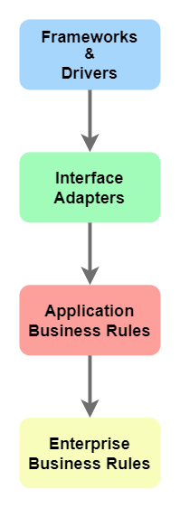

# CLEAN

## Clean Architecture — Aislando los detalles
https://medium.com/bancolombia-tech/clean-architecture-aislando-los-detalles-4f9530f35d7a

Los framework, librerías o moda pasan y estos cambios trae incertidumbre.

Es por ello que, con el pasar del tiempo, han surgido una variedad de arquitecturas que **favorecen, protegen y aíslan las características esenciales y fundamentales** de un sistema de software, de aquellos elementos **auxiliares, provisionales o circunstanciales** que la acompañan.

### DEFINICIÓN
La arquitectura de un sistema puede entenderse como la estructura y las reglas que guían y gobiernan la organización de los componentes que lo conforman, así también, como los lineamientos sobre el diseño e implementación de dichos componentes

Según el tio bob: Martin nos recuerda que el software debe ser flexible y adaptarse al cambio, de tal manera que de forma sencilla y oportuna se altere el comportamiento de un sistema. Esta flexibilidad depende en gran medida de la forma, disposición e intercomunicación otorgada a esos componentes

Complejidad, se divide en dos
- Complejidad esencial (es el problema)
- Complejidad accidental (es la complejidad inyectada por la solución del problema)

Componentes:
- Entities ->  Capa de dominio donde están las reglas de negocio
- UseCase -> Implementa los casos de uso del sistema
  "La capa del dominio encapsula únicamente las reglas y procesos definidos por el negocio"
- Entry — Point -> Infrastructure, define y agrupa el conjunto de adaptadores, lo que le permite exponer las capacidades de los casos de uso
- Driven-Adapters -> infraestructura, adapta y traduce al lenguaje de dominio, interacciones con subsistemas e infraestructura externa al dominio
" La capa de infraestructura al ser una frontera con el exterior, es altamente variable y dependiente de la tecnología, es por ello que esta capa reúne y aísla la complejidad accidental asociada al trabajar de forma directa con la tecnología."
- Application -> Este módulo es el más externo de la arquitectura, es el encargado de ensamblar los distintos módulos, resolver las dependencias y crear los UseCases, inyectando en éstos instancias concretas de las dependencias declaradas, además de iniciar la aplicación

## The Clean Architecture — Beginner’s Guide

Advantages of Proper Architecture
- Testable
- Maintainable
- Changeable
- Easy to Develop
- Easy to Deploy
- Independent

**The Dependency Rule**
The Dependency Rule states that the source code dependencies can only point inwards.

#### Frameworks and Drivers
- User Interface
- Database
- External Interfaces (eg: Native platform API)
- Web (eg: Network Request)
- Devices (eg: Printers and Scanners)

#### Interface Adapters
- Presenters (UI Logic, States)
- Controllers (Interface that holds methods needed by the application which is implemented by Web, Devices or External Interfaces)
- Gateways (Interface that holds every CRUD operation performed by the application, implemented by DB)

#### Application Business Rules
ules which are not Core-business-rules but essential for this particular application come under this. This layer holds **Use Cases**. 

#### Enterprise Business Rules
This is the layer that holds core-business rules or domain-specific business rules. Also, this layer is the least prone to change.

## Clean Architecture — C. Martin (Uncle Bob)
https://blog.devgenius.io/clean-architecture-c-martin-uncle-bob-5a7a17e4fadb

¿Cómo funciona?
Clean pone el **CORE** en el centro, es decir las reglas de negocio y modelos de aplicación.

#### Promesas
- Independiente del framework
- Independiente de la base de datos
- Independiente de la UI
- Testeable
- Independiente de dependencias externas

#### Layers:
- Presentation: ViewModel, presenter implementation, adapter
- Domain Layer: Use cases or callback and interfaces of the repository
- Data Layer: database, UI, storage, and network. Entity repository implementation and business logic.

