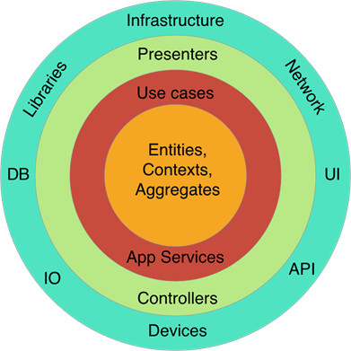
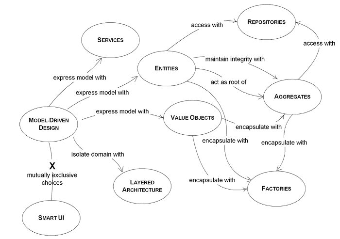

# DDD

## Hexagonal architecture and Domain Driven Design
REF=https://towardsdev.com/hexagonal-architecture-and-domain-driven-design-bc2525dbc05f

Se piensa que DDD solo se puede aplicar a microservicios. Pero no es así.

Según DDD debemos crear un ubiquitous language, que es lo mismo que decir un lenguaje en común para todos (teach team, domain team)

El propósito de DDD es enfocarse en la implementación de dominio y no preocuparse por decisiones técnicas pronto.

## Diseño dirigido por dominio (DDD)
REF= https://medium.com/@avniozunlu/domain-driven-design-ddd-151c90472914
DDD no es una tecnología avanzada o un método específico.

**Contexto acotado**, Un dominio complejo puede contener subdominios.
DDD recomienda que diseñemos nuestro sistema de tal manera que estos contextos limitados se comuniquen entre sí a través de ciertos protocolos

En resumen, debemos crear nuestras clases no de forma que corresponda a una tabla en nuestra base de datos, sino en la estructura donde colocaremos nuestra lógica de negocios, es decir, agregando lógica a las entidades.

**Agregates**: Son entidades que juntas son un mismo objeto en si

### Capas
· Capa de Dominio

· Capa de aplicación

· Capa de presentación

· Capa de Infraestructura

Si bien necesitamos implementar lo principal de nuestro negocio en la capa de dominio, debemos definir sus casos de uso en la capa de aplicación.

Se afirma que la cuestión más importante es mantener al mínimo la dependencia de la capa de dominio de otras capas.

## DDD 101 — El recorrido de 5 minutos
REF= https://medium.com/the-coding-matrix/ddd-101-the-5-minute-tour-7a3037cf53b8

**El lenguaje ubicuo**: Un lenguaje en común
Código que se explique solo

¿Cuántos de nosotros, desarrolladores, acabamos de echar un vistazo a los requisitos solo para comenzar a codificar de inmediato? ¿Cuántos programadores han hojeado las reglas de negocio para saltar al aspecto del marco y de la base de datos del proyecto? No finjas, ¡lo sé con seguridad!

ESTO ES DDD
Modelas tu negocio usandoEntidades(la identificación importa) yObjetos de valor(los valores importan). Tu usasRepositoriospara recuperarlos y almacenarlos. Los creas con la ayuda deFábricas. Si un objeto es demasiado complejo para una sola clase, crearáagregadoseso se uniráEntidades&Objetos de valorbajo la misma raíz. Si una lógica de negocios no pertenece a un objeto determinado, definiráServiciosque manipulará los elementos involucrados. Eventualmente, cuando cambie el estado del negocio (un cambio que es importante para los expertos en negocios), publicaráEventos de dominiopara comunicar el cambio.