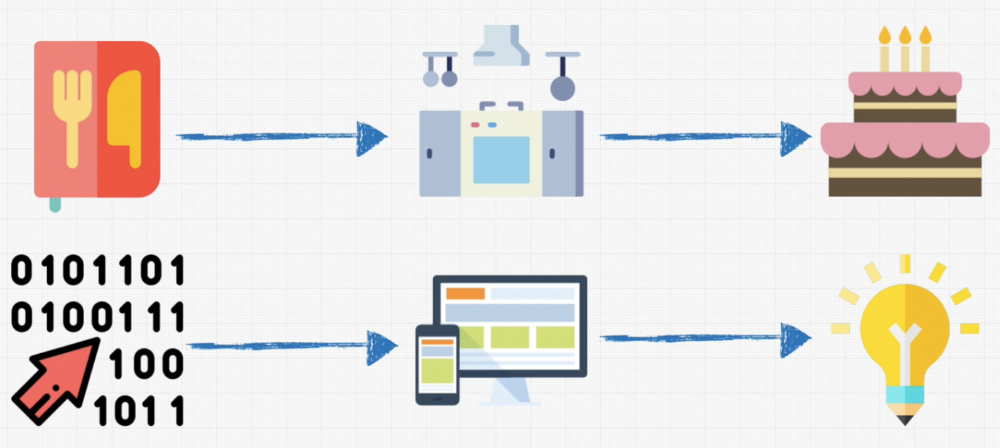

# Zero Mastery

## Big O
chatsheet: https://www.dropbox.com/s/w1ogy8310myxs9f/BigO_Cheatsheet_Zero_To_Mastery_V1.01.pdf?utm_campaign=your_big_o_cheatsheet_pdf_download&utm_medium=email&utm_source=mailerlite&utm_term=2022-10-21&dl=0

### What is good code ?
1- Readable
2- Scalable (BigO help us with this)

Instrucciones al computador para producir un resultado.

BigO: Es la forma que podemos comparar que tan rápido/lento será un algoritmo

https://github.com/satya-verma/Data-Structures-and-Algorithms--using-JAVA
https://github.com/nimrod46/Data-Structures-and-Algorithms