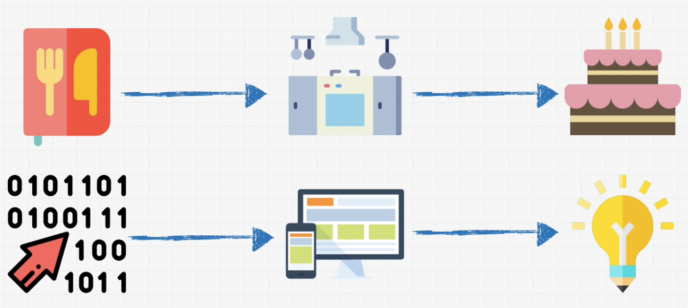

# Zero Mastery

## Big O
chatsheet: https://www.dropbox.com/s/w1ogy8310myxs9f/BigO_Cheatsheet_Zero_To_Mastery_V1.01.pdf?utm_campaign=your_big_o_cheatsheet_pdf_download&utm_medium=email&utm_source=mailerlite&utm_term=2022-10-21&dl=0
https://www.bigocheatsheet.com

### What is good code ?
1- Readable
2- Scalable
  - Speed (BigO help us with this)
  - Memory

Instrucciones al computador para producir un resultado.

BigO: Es la forma que podemos comparar que tan rápido/lento será un algoritmo

#### BigO Rules
- Worst case
- Remove constants
- Different terms for inputs
  * calcular bigO para diferentes entradas y sumar o multiplicar O(a+b), O(a*b)
- Drop non dominants

**Data Structures + Algorithms = Programs**
### Google Interview video

1. When the interviewer says the question, write down the key points at the top (i.e. sorted array). Make sure you have all the details. Show how organized you are.
   - Collection numbers
   - Matching pair that is a sum that is giving from problem
2. Make sure you double check: What are the inputs? What are the outputs?
   - collection, sum number => yes no 
3. What is the most important value of the problem? Do you have time, and space and memory,
etc.. What is the main goal?
  - No dicen
4. Don't be annoying and ask too many questions.
   - se pueden repetidos, doubles
5. Start with the naive/brute force approach. First thing that comes into mind. It shows that you’re able to think well and critically (you don't need to write this code, just speak about it).
   - doble for sería la fuerza bruta acá
6. Tell them why this approach is not the best (i.e. O(n^2) or higher, not readable, etc...)
   - O(n^2)
7. Walk through your approach, comment things and see where you may be able to break things. Any repetition, bottlenecks like O(N^2), or unnecessary work? Did you use all 
   - 
8. the information the interviewer gave you? Bottleneck is the part of the code with the biggest Big O. Focus on that. Sometimes this occurs with repeated work as well.
9.  Before you start coding, walk through your code and write down the steps you are going to follow.
10. Modularize your code from the very beginning. Break up your code into beautiful small pieces and add just comments if you need to.
11. Start actually writing your code now. Keep in mind that the more you prepare and understand what you need to code, the better the whiteboard will go. So never start a whiteboard interview not being sure of how things are going to work out. That is a recipe for disaster. Keep in mind: A lot of interviews ask questions that you won’t be able to fully answer on time. So think: What can I show in order to show that I can do this and I am better than other coders. Break things up in Functions (if you can’t remember a method, just make up a function and you will at least have it there. Write something, and start with the easy part.
12. Think about error checks and how you can break this code. Never make assumptions about the input. Assume people are trying to break your code and that Darth Vader is using your function. How will you safeguard it? Always check for false inputs that you don’t want. Here is a trick: Comment in the code, the checks that you want to do... write the function, then tell the interviewer that you would write tests now to make your function fail (but you won't need to actually write the tests).
13. Don’t use bad/confusing names like i and j. Write code that reads well.
14. Test your code: Check for no params, 0, undefined, null, massive arrays, async code, etc... Ask the interviewer if we can make assumption about the code. Can you make the answer return an error? Poke holes into your solution. Are you repeating yourself?
15. Finally talk to the interviewer where you would improve the code. Does it work? Are there different approaches? Is it readable? What would you google to improve? How can performance be improved? Possibly: Ask the interviewer what was the most interesting solution you have seen to this problem
16. If your interviewer is happy with the solution, the interview usually ends here. It is also common that the interviewer asks you extension questions, such as how you would handle the problem if the whole input is too large to fit into memory, or if the input arrives as a stream. This is a common follow-up question at Google, where they care a lot about scale. The answer is usually a divide-and-conquer approach — perform distributed processing of the data and only read certain chunks of the input from disk into memory, write the output back to disk and combine them later.

## Data structure

Es una colección de values
Las estructuras son útiles y especializadas para algo

exercism 

https://github.com/satya-verma/Data-Structures-and-Algorithms--using-JAVA
https://github.com/nimrod46/Data-Structures-and-Algorithms