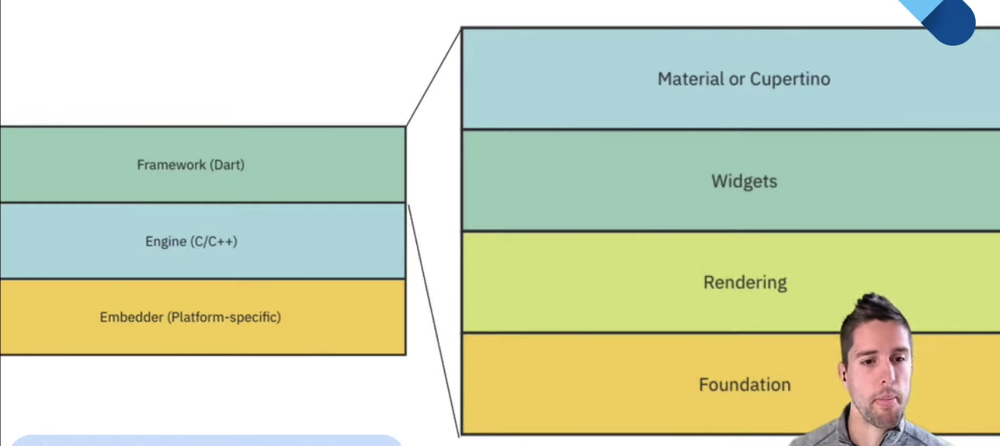

# Widgets

Widgets :: 20th Oct 2021 :: Flutter Apprentice Book Club
[REF](https://www.youtube.com/watch?v=Llnq61KyOPg)

Pregunta seria:

- ¿cuál de estos dos estilos vamos a usar material o cupertino ?

Todo es un widget

- Para tener widgets consistentes usa un tema (centralizar esto)
- ThemeData -> MaterialApp
- Algunas cosas importantes en ThemeData
  - brightness
  - textTheme
  - bottomNavigationBarTheme
  - appBarTheme
  - checkboxTheme

Mantener la mayor cantidad de los estilos en un solo lugar

UI = f(state)

### The 3 trees

