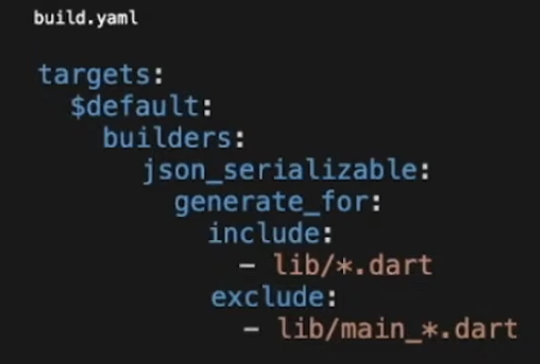

# Flutter Vikings

### Micro FrontEnds

¿Cómo podemos hacer una mejora a monolitos? = Micro services
MicroFrontend - BFF

Ventajas

- Decoupled codebases
- less conflicts
- shorter adaptation curve for new developers
- be technology agnostic
- best performance on development IDE
- scalability

Ex: monolito

- Core
- Design System
- Módulos (features)

tener un paquete para las dependencias
usar github submodule

REF [example](https://github.com/Bwolfs2/movie_app)

### Create your own Code Generation Package

build_runner: Code generator
Podemos especificar que files queremos que sean generados

--- OPEN API

### Common mistakes to avoid while developing a Flutter App

Preocupate por el diseño : Flutter flow

- theme
- widget structure
- architecture
- readme
- linting rules

package to see other devices: device_preview
Don't over-load with packages
