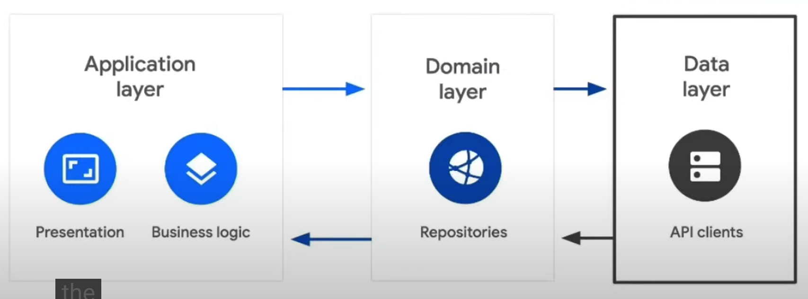

# Flutter Festival London

[REF2](https://www.youtube.com/watch?v=h7Hjtj-iw_c)

## Day 2

### Flutter Layered architecture

[REF](https://verygood.ventures/blog/very-good-flutter-architecture)

- ¿Qué es arquitectura?
  La forma lógica de organizar tus proyectos, folder, código y capas

- ¿Qué son las capas (layers)?
  Son los componentes que componen tu arquitectura

Single responsibility principle

- Tener clases simples, más pequeñas con único propósito
- Mejor separación para testing
- Mantener una funcionalidad especifica sin afectar otras

Tenemos tres responsabilidades en una aplicación

1. Interactuar con la API (data layer)
2. Manipular o transformar la información de la API (Domain)
3. Presentar la información (Presentation)

Evitar responsabilidades compartidas
DataLayer = Infrastructure

- Mantener el naming consistente con tu arquitectura
- Crea cosas reusables
- Usa la cantidad correcta de abstracción
- Don't over-engineer
- Escoger las herramientas correcta (packages)
- Siempre ve nuevos puntos de vista
- Refactor: Aprender de los errores

github.com/VGVentures/photobooth
github.com/VGVentures/spacex_demo
github.com/VGVentures/slide_puzzle
github.com/VGVentures/chat_location
github.com/felangel/bloc/tree/master/examples
github.com/NoScope Devs/bloc_samples
