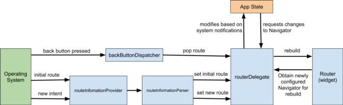

# Navigator2

https://medium.com/comunidad-flutter/aprendiendo-del-nuevo-navigator-2-0-y-del-sistema-de-routing-450a1d60e210

https://ulusoyca.medium.com/flutter-navigator-2-0-for-authentication-and-bootstrapping-part-3-authentication-93dbcb5f0f0a

Cambio de imperativo a declarativo
Mejor soporte a web, manejo de rutas dinamicas, deep links y otros

- **Page** — un objeto inmutable usado para iniciar el stack de historial del navigator.

- **Router** — configura la lista de las páginas a ser mostradas por el Navigator. Normalmente esta es una lista de páginas que cambia dependiendo de la plataforma, o sobre el estado cambiante del app.
  
- **RouteInformationParser**, el cual toma la RouteInformation de RouteInformationProvide y lo parsea dentro de una data-type definido por el usuario.

- **RouterDelegate** — define el comportamiento especifico de la app de cómo el Router aprende acerca de los cambios en el estado de la app y cómo responde a ellos. Su trabajo es escuchar RouteInformationParser y el estado de la app y construir él Navigator con la lista actual de Páginas .

- **BackButtonDispatcher** — notifica al Router cuando el botón de back es presionado.

1. Cuando la plataforma emite una nueva ruta (por ejemplo, "books/2"), el RouteInformationParser lo convierte dentro data typeT abstracto el cual definirás en tu app (por ejemplo, una clase llamada BooksRoutePath ).
   
2. El método setNewRoutePath del RouteDelegate es llamado con este data type, y debe actualizar el estado de la aplicación para reflejar el cambio (por ejemplo, al seleccionar el selectdBookId ) y llamar notifyListeners .

3. Cuando notifyListeners es llamado, le pide al Router reconstruya el RouterDelegate (usando su método build() )

4. RouterDelegate.build() regresa un nuevo Navigator, en la cual sus páginas reflejas el cambio en el estado de la app (por ejemplo, selectedBookId).

### RouterDelegate
Es el corazón del navegador

https://github.com/csells/go_router/blob/main/go_router/lib/src/go_router_delegate.dart

https://github.com/flutter/packages/blob/main/packages/go_router/lib/src/delegate.dart

https://github.com/slovnicki/beamer/blob/master/package/lib/src/beamer_delegate.dart

https://github.com/slovnicki/beamer/blob/master/package/lib/src/beam_location.dart

https://github.com/tomgilder/routemaster/tree/main/lib/src

https://github.com/HosseinYousefi/yeet/blob/master/lib/src/yeeter_delegate.dart

https://github.com/lukepighetti/fluro/tree/main/lib/src

https://stackoverflow.com/questions/64060944/how-to-implement-a-stack-with-push-and-pop-in-dart

https://github.com/dleurs/Flutter-Navigator-2.0-demo-with-Authentication-mecanism/blob/master/lib/src/navigation/my_router_delegate.dart