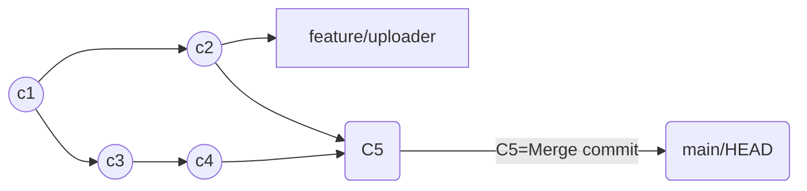
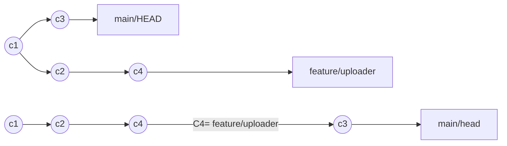

# GIT Branches

Esté notas fueron tomadas del siguiente [video](https://www.youtube.com/watch?v=e2IbNHi4uCI).

Vamos a intentar traer algunos conceptos útiles para el manejo de ramas.
Lo primero es el HEAD branch, esta es tu rama principal.

Otra distinción importante es local and remote branches.

-> Vamos a crear una nueva rama.

- Git supone que tu quieres empezar tu nueva rama desde el current checkpoint

-> Si quiero empezar mi rama desde un commit especifico debo especificar el #id del commit

-> Cambiar de branch con git checkout

-> Para cambiar el nombre en remoto de una rama.
`git push origin --delete <old-name>`
`git push -u origin <new-name>`

-> -u es para hacer un tracking, tener enlazadas si por alguna razón creas una rama sin -u luego tienes que enlazarla si quieres hacer un tracking más efectivo

-> Descargar una rama en un repositorio que no tengo tracking en local
`git branch --track <local-name> origin/<remote-name>`
`git checkout --track origin/<remote-name>`

delete branch
-d -D

Merge vs Rebase

MERGE:

REBASE:

