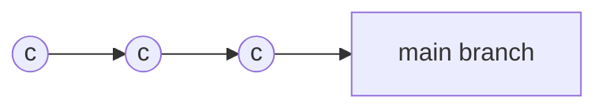

# GIT Mastering

### EL commit perfecto:

- Agregando lo necesario para esto.
- Creando un buen mensaje

Crear commits de archivos relacionados
fracionando la información o el propósito

Para fraccionar la información de un commit, podemos usar -p => patch
`git add -p <file-name>`

Subject = Sumarry
Body =

- What is now different than before
- What's the reason of the change
- Is there anything to watchg or anything particulary remarkable?

`git commit`

### Branching history

1. Git permite crear ramas pero no te dice cómo usarlas
2. Necesitas tener buenas practicas pra el manejo de estas ramas, para evitar errores
3. Depende completamente de tu equipo y de la estrategia que establezcan (conveciones)
4. Te ayudará con el onboarding de nuevos miembros (Así es como trabajamos)

Integrating changes & structuring releasing

1. Mainline developmente (Always be integrated)
2. State, release and feature branches

Cómo luce? #1 Mainline developmente

1- Few branches
2- Relative small commits
3- High quality testing & QA standars

Cómo luce? #2 State, release and feature branches

- Diferentes tipos de ramas
- Diferentes tipos de trabajos

* Dos diferentes tipos de ramas: Long-runnig, and shortLive Branches

  - Long-running: main, develop son ramas que viven para siempre en la vida de tu proyecto
    Ramas de calidad, ramas de deployment

  - short: For new features, fix-bugs, refactoring, experiment
    deberian ser borradas depues de hacer merge/rebase

## GitFLOW

- Más estructurado, más reglas
- long-running: main + develop
- short-lived: features, releases, hotfixes

## Pull request

No es un concepto base de git, puede tener diferncias entre github, gitlab o bitbucket
**Communicating about and reviewing code**
Invitar a personas a proveer un feedback acerca de una nueva funcionalidad

# merge conflicts

- Cuándo pasan ?
- Qué son realmente ?
- Cómo solucionarlos

Cuando integras una rama desde diferentes fuentes, esto ocurre con frecuencia cuando hacemos: rebase, merge, stash, cherry-pick
Las ramas son la funcionalidad más importante de git pero es importante entender que Git requiere intervención humana en ciertos casos.

¿Cómo devolvemos un conflicto y empezamos de nuevo ?
`git merge --abort`
`git rebase --abort`

¿Cómo se resuelve el conflicto?
Limpiando el archivo y dejando la versión final

# merge vs rebase

La primera aclaración es que ninguno es mejor que el otro, tiene ventajas y desventajas.

Veamos un escenario muy comun con dos ramas que tienen un ancentro en común, recuerden el propósito es combinar el estado de las dos ramas en una sola.

## Merge

A Fast-Forward Merge:
La solución es muy sencilla Git pone todos los commits de la rama B después de los commits de la rama A (on the top)
Después de eso, las dos ramas tienen el mismo historial.

El resultado de hacer la mezcla se llama merge-commit, es creado automaticamente por git.

## Rebase

El escenario es el mismo que la primera vez, queremos integrar la rama B en (into) la rama A.

Pero que ocurre detrás de escena:

1. Git 'remueve' todos los commits de la rama A que son realizados despues del commit ancestro.
2. Luego aplica los commits de la rama B a la rama A(donde estamos integrando)
3. Luego Git posiciona los commits de la rama A después de la rama B (on the top)

PD: el commit C3 en la siguiente imagen tiene un \*, porque tecnicamente es un nuevo commit que se ha cambiado quien es su ancestro. El problema grande con esto es si otro developer esta basando su trabajo en el c3 original y yo hago push al servidor, el commit c3 ya no existe.

#### Alertas

- No usar rebase en commits que ya se han pusheado a repositorios publicos
- Usar para limpiar mi historial local después de mezclar en (into) a una rama compartida

¿Qué diferencias hay?

- No tenemos merge-commit
- El historial es lineal
- Solo la rama hacia donde hice el rebase conserva el historial
