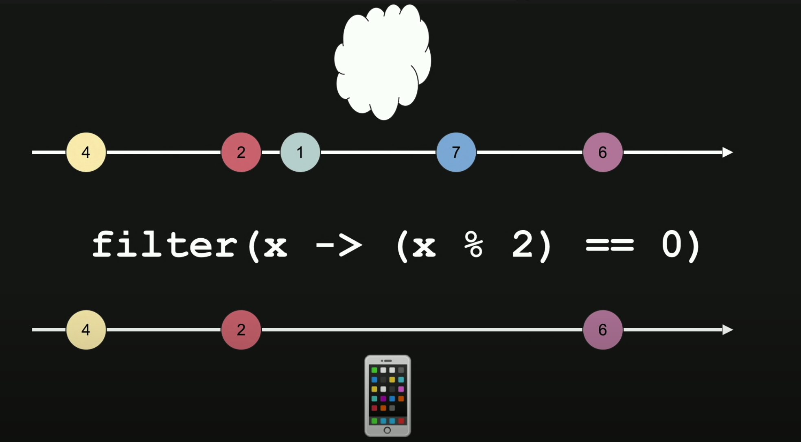

# Reactive Programming

## ¿Qué es la programación reactiva?

[REF](https://www.youtube.com/watch?v=tUB3rNsMYAk)

- Es un paradigma de programación asíncrona
- Trata de reaccionar al cambio
- Orientada al flujo de datos(cambios de valores)
- propagación del cambio (notificar los cambios)

Observable (quien hace algo cambio)
Suscripción (función que notifica)
Observer (quien esta esperando que pase algo)

### manifesto reactivo:

¿Qué debe tener el sistema de datos?

- Responsivo (Debe ser rápido)
- Elasticos (Aguantar diferente carga de usuarios)
- Resilientes (Si hay errores el sistema no debe caerse)
- Orientado a mensajes (que se desacoplen las diferentes partes)

### Conceptos básicos

- Stream de datos: Es por donde viajan los datos
- Observable: La función que captura ese flujo de datos
- Subject: Es el sistema que dispara el evento
- Subscription: La función para conectarte con un observable y recibir los eventos
- Observer: Los que están esperando los cambios del observable
- Pipes: Funciones para manipular los datos

### Patrón observador

Desde acá parte la programación

---

## Intro to Reactive Programming

Nos permite manipular stream de datos con funciones asíncronas

Se enfoca en tres aspectos:
1- Data streams
2- Functional programming
3- Asíncronos observers

Usos:

- Buscar información en una base de datos
- Render UI que combina data desde diferentes fuentes
- Crear modelos en tiempo real para stocks prices
- Mostrar auto-complete resultados de búsquedas
- Log data from sensores

Ex:

Subject: Quien produce los eventos.
Observer: Quien consume los eventos.

Funciones pueden manipular los eventos
Funciones pueden enviar los eventos a otra función

80% de los lenguajes son imperativos or multi-paradigma

#### ¿Qué es un paradigma?

Son diferentes formas de llegar a un resultado

- Imperative Programming

  - Describe como el programa opera
  - Usa statements to change (state)
  - Conditional statements, loops, inheritance
  - Fácil para iniciar

- Functional Programming
  - Describe el 'que' del programa
  - Ideally stateless
  - Evalúa funciones y crea expresiones como resultado
  - Más difícil
