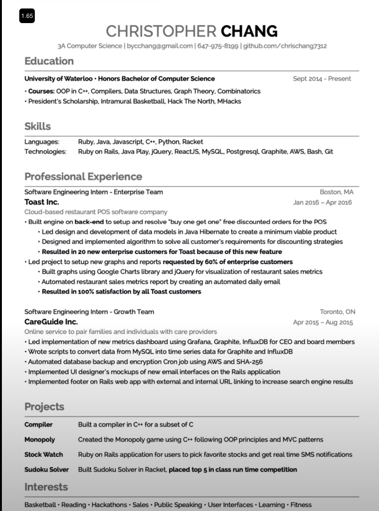

# Mejorar tu curriculum

https://www.carrus.io
CURSO: https://www.tryexponent.com/courses/software-engineering
https://www.tryexponent.com/courses/get-the-interview/sample-pm-resume

Tools: 
- https://resumeworded.com/
- https://www.topresume.com/

### The Resume That Got Me Into Google and Bloomberg:
-> https://www.youtube.com/watch?v=aHB8bx4P7TE&t=93s
* No foto
* Experiencia primero
* Proyectos
* Language
* No dos columns
  
Este: 
* Projects: 1 Line
* Skills, Language and technologies
* Dos experiencia (con más cosas que decir)

### Resume That Got Me Into Google
-> https://www.youtube.com/watch?v=rcSKRSg48hM
* Job title
* Keywords
* List accomplishments NO TASK
* Get a referal

### The Resume That Got Me Into Google 
-> https://www.youtube.com/watch?v=aKjsy-b00QM
  
### The RESUME that got me into GOOGLE | RESUME TIPS
-> https://www.youtube.com/watch?v=Aus-Eokb1mY
* Action Verbs
* Cuantificar

### Amazon Recruiter Shares His 21 Resume Writing Tips and Advice | Amazon News
-> https://www.youtube.com/watch?v=zT8Bmuq51uU
* 1 Page
* PDF
* No typos
* Hire a professional profile writer
* Skill section
* Summary: Short and sweet
* Links
* Company details
* LINKEDIN
* Action words
* Include data points (money, indicators, numbers)
* Filling in the gaps
* Interests
* YourName_Resume_Year

### Write an Amazing Cover Letter: 3 Golden Rules (Template included)
-> https://www.youtube.com/watch?v=NUhDP30IRKk
* Mention a connection

# Three of our top coaches
https://www.carrus.io/blog/insider-advice-on-crafting-your-resume-to-catch-the-attention-of-hiring-managers-at-google-apple-amazon
* Logró [X] medido por [Y], haciendo [Z].
* Si puede proporcionar una medida concreta de su logro, su currículum se destacará.
* Sea simple

## How to Write a Resume for Google (with examples)
https://blog.tryexponent.com/google-resume/
* estudie la descripción del trabajo.
* Una página
* Tamaño de letra razonable
* Formato consistente
* Sin fotos
* Ejemplo: https://www.tryexponent.com/courses/get-the-interview/sample-pm-resume

## Google Education
https://applieddigitalskills.withgoogle.com/c/middle-and-high-school/en/create-a-resume-in-google-docs/overview.html

### How To Get A Job At Google | 5 Resume Mistakes To Avoid In 2020
https://www.youtube.com/watch?v=Gj0k_fEszV8
* Number, impact
* Make interest quete and sweet
* Show the competition
* Templates: - Buy https://www.faangtechleads.com/

### Create Your Resume for Google: Tips and Advice
https://www.youtube.com/watch?v=BYUy1yvjHxE&t=5s
* Format: Simple and consistent design, font, sizing and spacing
* 1 pagina o dos si mucho
* Evitar typos
* Skills in top
* Github
* Experiencia: De reciente a antiguo, tiempo y descripción => action works
* Experiencia: Metricas y ejemplos
* Incluir lenguage en experiencia 

### Resume for FAANG
https://www.techinterviewhandbook.org/resume/

## ZTM
✅ Use a pre-designed resume template
✅ Make the resume fit on 1 page
✅ Include words from job description
✅ Include company name you are applying to
✅ Does your first item on your resume reflect what they are looking for?
✅ Experience titles demonstrate value
✅ Do you have an online link?
✅ Remove the word “I”
✅ No buzzwords describing how great you are
✅ Are you using Action words?
✅ Measure everything in terms of impact, don’t just describe your responsibilities
✅ Technical Knowledge/Skills should include what they are looking for. Only show years if it is impressive
✅ Include only sections/items that are impressive: Experience, Projects, Education, Technical Skills
✅ No typos or bad grammar

🙌 Quiero compartir los 10 factores que tuve en cuenta cuando decidí si cambiarme (o no) de trabajo y a cuál de las opciones que tenía.

Por si puede ser útil para vosotros.

1. Condiciones económicas

2. Proyección interna

3. Nivel del rol

4. Atractivo del rol

5. Perspectivas de futuro

6. Atractivo del lugar (ciudad donde vivir)

7. Vida social

8. Estabilidad de la empresa

9. Seguridad de la contratación

10. Opinión de los otros (prestigio)

Con los 10 factores y las empresas hice una tabla (en la imagen), asigné un scoring e hice una ponderación.

Disculpad si está en sucio. Hice este ejercicio en un avión.

Voy a intentar explicar qué es para mí cada factor.

¿Qué os parece?

¿Añadirías algún otro?

# Email template
Hey $BOB,
I saw your presentation at $CONFERENCE last year on Youtube (rr point to some work they have done).
Great stuff; loved what you did with $FOO, in particular
$COMMENT_PROVING_YOU_KNOW_WHAT_YOU'RE_TALKING_ABOUT.
I'm also a $FOO developer. I noticed that your company is hiring
or $ROLE. I’d love to be a part of your team. Do you have a
few minutes to chat on Thursday about what you guys are doing?
 
Thanks,
Yourname
Your website or any public profile link

-hackernews who is hiring
https://weworkremotely.com

https://www.linkedin.com/feed/update/urn:li:activity:6988157974028443648/?updateEntityUrn=urn%3Ali%3Afs_feedUpdate%3A%28V2%2Curn%3Ali%3Aactivity%3A6988157974028443648%29